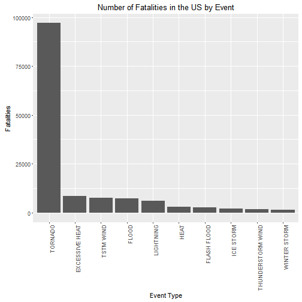
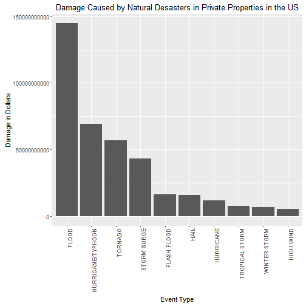
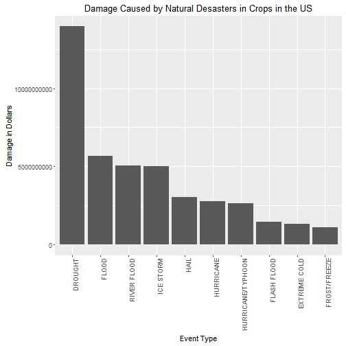

Disaster Events and Its Consequences in the U.S.A
=====================================================================

### Synopsis
The objective of this report is to answer questions and show which natural desaster is the most dangerous for the people and for the economy. This report can be used as an input to prioritize efforts and reduce the impacts of natural disasters in the U.S.

### Data Processing
The data was download from the U.S. National Oceanic and Atmospheric Administration's (NOAA) website ([DOWNLOAD HERE](https://d396qusza40orc.cloudfront.net/repdata%2Fdata%2FStormData.csv.bz2))  

The hole documentation about the file can be found [HERE](https://d396qusza40orc.cloudfront.net/repdata%2Fpeer2_doc%2Fpd01016005curr.pdf)  

- At first we load the raw data:

```r
options(scipen = 999999, digits = 22)
setwd("C:\\Users\\Renato\\RWeather")
raw <- read.csv("repdata-data-StormData.csv.bz2", stringsAsFactors = FALSE)
```
- After that we need to transform the variables EXP in order to calculate the total damage. H = 100, K = 1000, M = 1000000, B = 1000000000, 0..8 = 10, ? = 0, "" = 0.

```r
# Load dplyr library
library(dplyr, quietly = TRUE)
```

```
## 
## Attaching package: 'dplyr'
```

```
## The following objects are masked from 'package:stats':
## 
##     filter, lag
```

```
## The following objects are masked from 'package:base':
## 
##     intersect, setdiff, setequal, union
```

```r
# Change the values in the df in order to calculate de total dmg
exp_transf <- transform(raw, CROPDMGEXP = ifelse(CROPDMGEXP == "H" | CROPDMGEXP == "h", 100, CROPDMGEXP))
exp_transf <- transform(exp_transf, CROPDMGEXP = ifelse(CROPDMGEXP == "0", 10, CROPDMGEXP))
exp_transf <- transform(exp_transf, CROPDMGEXP = ifelse(CROPDMGEXP == "1", 10, CROPDMGEXP))
exp_transf <- transform(exp_transf, CROPDMGEXP = ifelse(CROPDMGEXP == "K" | CROPDMGEXP == "k", 1000, CROPDMGEXP))
exp_transf <- transform(exp_transf, CROPDMGEXP = ifelse(CROPDMGEXP == "M" | CROPDMGEXP == "m", 1000000, CROPDMGEXP))
exp_transf <- transform(exp_transf, CROPDMGEXP = ifelse(CROPDMGEXP == "B" | CROPDMGEXP == "b", 1000000000, CROPDMGEXP))
exp_transf <- transform(exp_transf, CROPDMGEXP = ifelse(CROPDMGEXP == "?", 0, CROPDMGEXP))
exp_transf <- transform(exp_transf, CROPDMGEXP = ifelse(CROPDMGEXP == "+", 1, CROPDMGEXP))
exp_transf <- transform(exp_transf, CROPDMGEXP = ifelse(CROPDMGEXP == "-", 0, CROPDMGEXP))
exp_transf <- transform(exp_transf, CROPDMGEXP = ifelse(CROPDMGEXP == "", 0, CROPDMGEXP))
exp_transf <- transform(exp_transf, CROPDMGEXP = ifelse(CROPDMGEXP == "2", 10, CROPDMGEXP))
exp_transf <- transform(exp_transf, CROPDMGEXP = ifelse(CROPDMGEXP == "3", 10, CROPDMGEXP))
exp_transf <- transform(exp_transf, CROPDMGEXP = ifelse(CROPDMGEXP == "4", 10, CROPDMGEXP))
exp_transf <- transform(exp_transf, CROPDMGEXP = ifelse(CROPDMGEXP == "5", 10, CROPDMGEXP))
exp_transf <- transform(exp_transf, CROPDMGEXP = ifelse(CROPDMGEXP == "6", 10, CROPDMGEXP))
exp_transf <- transform(exp_transf, CROPDMGEXP = ifelse(CROPDMGEXP == "7", 10, CROPDMGEXP))
exp_transf <- transform(exp_transf, CROPDMGEXP = ifelse(CROPDMGEXP == "8", 10, CROPDMGEXP))

exp_transf <- transform(exp_transf, PROPDMGEXP = ifelse(PROPDMGEXP == "H" | PROPDMGEXP == "h", 100, PROPDMGEXP))
exp_transf <- transform(exp_transf, PROPDMGEXP = ifelse(PROPDMGEXP == "0", 10, PROPDMGEXP))
exp_transf <- transform(exp_transf, PROPDMGEXP = ifelse(PROPDMGEXP == "1", 10, PROPDMGEXP))
exp_transf <- transform(exp_transf, PROPDMGEXP = ifelse(PROPDMGEXP == "K" | PROPDMGEXP == "k", 1000, PROPDMGEXP))
exp_transf <- transform(exp_transf, PROPDMGEXP = ifelse(PROPDMGEXP == "M" | PROPDMGEXP == "m", 1000000, PROPDMGEXP))
exp_transf <- transform(exp_transf, PROPDMGEXP = ifelse(PROPDMGEXP == "B" | PROPDMGEXP == "b", 1000000000, PROPDMGEXP))
exp_transf <- transform(exp_transf, PROPDMGEXP = ifelse(PROPDMGEXP == "?", 0, PROPDMGEXP))
exp_transf <- transform(exp_transf, PROPDMGEXP = ifelse(PROPDMGEXP == "+", 1, PROPDMGEXP))
exp_transf <- transform(exp_transf, PROPDMGEXP = ifelse(PROPDMGEXP == "-", 0, PROPDMGEXP))
exp_transf <- transform(exp_transf, PROPDMGEXP = ifelse(PROPDMGEXP == "", 0, PROPDMGEXP))
exp_transf <- transform(exp_transf, PROPDMGEXP = ifelse(PROPDMGEXP == "2", 10, PROPDMGEXP))
exp_transf <- transform(exp_transf, PROPDMGEXP = ifelse(PROPDMGEXP == "3", 10, PROPDMGEXP))
exp_transf <- transform(exp_transf, PROPDMGEXP = ifelse(PROPDMGEXP == "4", 10, PROPDMGEXP))
exp_transf <- transform(exp_transf, PROPDMGEXP = ifelse(PROPDMGEXP == "5", 10, PROPDMGEXP))
exp_transf <- transform(exp_transf, PROPDMGEXP = ifelse(PROPDMGEXP == "6", 10, PROPDMGEXP))
exp_transf <- transform(exp_transf, PROPDMGEXP = ifelse(PROPDMGEXP == "7", 10, PROPDMGEXP))
exp_transf <- transform(exp_transf, PROPDMGEXP = ifelse(PROPDMGEXP == "8", 10, PROPDMGEXP))
```
- Then we need to make some views of the data:

```r
# Load the sqldf library
library(sqldf, quietly = TRUE)
library(dplyr, quietly = TRUE)
library(tcltk, quietly = TRUE)

# Using sqldf to generate de aggragated views that we need
sum_prop_dmg <- sqldf("select sum(PROPDMG * PROPDMGEXP), EVTYPE from exp_transf group by EVTYPE")
sum_crop_dmg <- sqldf("select sum(CROPDMG * CROPDMGEXP), EVTYPE from exp_transf group by EVTYPE")
sum_pop_health <- sqldf("select sum(INJURIES + FATALITIES), EVTYPE from exp_transf group by EVTYPE")


# Change the colnames
colnames(sum_prop_dmg) <- c("damage","event")
colnames(sum_crop_dmg) <- c("damage","event")
colnames(sum_pop_health) <- c("damage","event")

# Transform to factor and order the data
sum_prop_dmg <- transform(sum_prop_dmg, event = as.factor(event))
sum_crop_dmg <- transform(sum_crop_dmg, event = as.factor(event))
sum_pop_health <- transform(sum_pop_health, event = as.factor(event))

sum_prop_dmg <- arrange(sum_prop_dmg, desc(damage))
sum_crop_dmg <- arrange(sum_crop_dmg, desc(damage))
sum_pop_health <- arrange(sum_pop_health, desc(damage))

# Extract the top 10 events of each view

sum_prop_dmg_10 <- head(sum_prop_dmg, n = 10)
sum_crop_dmg_10 <- head(sum_crop_dmg, n = 10)
sum_pop_health_10 <- head(sum_pop_health, n = 10)

# Order the levels

sum_prop_dmg_10$event <- factor(sum_prop_dmg_10$event, levels = sum_prop_dmg_10$event)
sum_crop_dmg_10$event <- factor(sum_crop_dmg_10$event, levels = sum_crop_dmg_10$event)
sum_pop_health_10$event <- factor(sum_pop_health_10$event, levels = sum_pop_health_10$event)
```
###Results
- Question 1: Across the United States, which types of events are most harmful with respect to population health?  
To answer this question I summarize the injuries and fatalities per event type and plotted the top 10


```r
library(ggplot2, quietly = TRUE)
ggplot(sum_pop_health_10, aes(x = event, y = damage)) + geom_bar(stat = "identity") +
    theme(axis.text.x = element_text(angle = 90, hjust = 1)) +
    xlab("Event Type") + ylab("Fatalities") + ggtitle("Number of Fatalities in the US by Event")
```



- Question 2: Across the United States, which types of events have the greatest economic consequences?
To answer this question I summarize the crop damage and properties damage 

```r
ggplot(sum_prop_dmg_10, aes(x = event, y = damage)) + geom_bar(stat = "identity") +
    theme(axis.text.x = element_text(angle = 90, hjust = 1)) +
    xlab("Event Type") + ylab("Damage in Dollars") + ggtitle("Damage Caused by Natural Desasters in Private Properties in the US")
```



```r
ggplot(sum_crop_dmg_10, aes(x = event, y = damage)) + geom_bar(stat = "identity") +
    theme(axis.text.x = element_text(angle = 90, hjust = 1)) +
    xlab("Event Type") + ylab("Damage in Dollars") + ggtitle("Damage Caused by Natural Desasters in Crops in the US")
```


